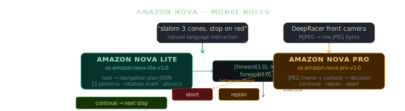
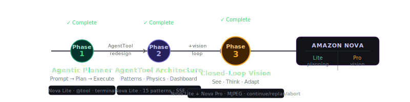
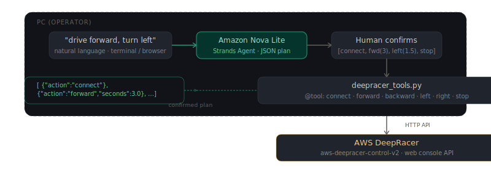
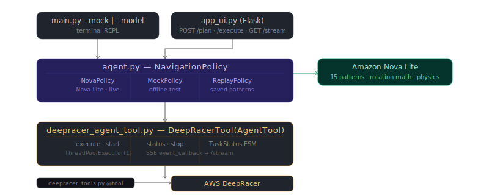
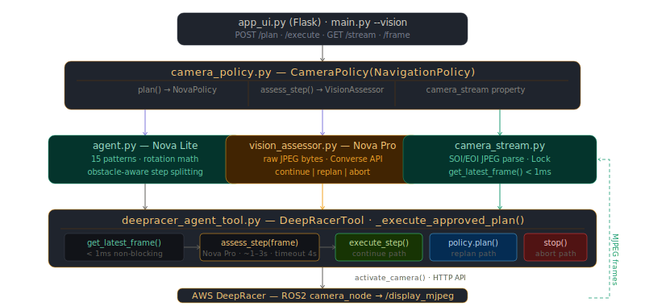
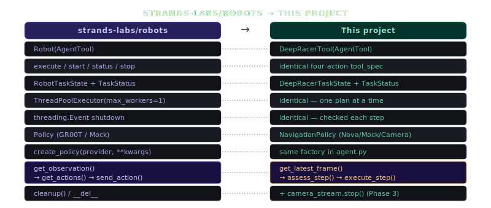

<div align="center">

 &nbsp; **×** &nbsp; 

# Prompt to Autonomous Drive

### Agentic DeepRacer powered by Strands SDK and Amazon Nova

*Type a sentence. Watch a 1/18-scale autonomous car plan, navigate, and adapt in real time — powered by Amazon Nova Lite and Nova Pro on Amazon Bedrock.*

[](https://strandsagents.com)
[](https://aws.amazon.com/deepracer/)
[](https://aws.amazon.com/bedrock/nova/)
[](https://aws.amazon.com/bedrock/)
[](https://python.org)
[](LICENSE)

<br/>

</div>

---

## What This Is

This project brings fully agentic AI navigation to an AWS DeepRacer 1/18-scale autonomous car. Instead of writing control scripts, you describe what you want the car to do in plain English — and it executes. Built end-to-end on the **Strands Agents SDK** and **Amazon Nova** (via Amazon Bedrock), with an architecture directly inspired by [strands-labs/robots](https://github.com/strands-labs/robots).

The project is structured across three phases, each adding a new layer of intelligence — from human-in-the-loop confirmation to closed-loop autonomous vision that adapts mid-execution.



---

## Phase Overview



---

## Phase 1 — Agentic Planner

The first proof of concept. A Strands Agent powered by **Amazon Nova Lite** receives a natural language instruction, produces a JSON movement plan, waits for human confirmation, then executes the full plan against the DeepRacer web API.



**Key characteristics:** single-shot planning, bare `@tool` functions, terminal REPL, basic Flask UI.

📁 [`phase-1-agentic-navigation-planner/`](./phase-1-agentic-navigation-planner/)

---

## Phase 2 — AgentTool Architecture

A ground-up redesign modelled on [strands-labs/robots](https://github.com/strands-labs/robots). **Amazon Nova Lite** drives all navigation planning — physics-aware, pattern-calibrated, and rotation-verified. Same interface (type, confirm, watch) but with a production-grade Strands `AgentTool` architecture underneath.



**Key additions over Phase 1:**
- `DeepRacerTool(AgentTool)` — four-action async interface mirroring strands-robots
- Physics-aware system prompt with rotation calibration, corner-speed limits, stabilisation rules
- 15 verified navigation patterns (circle, figure-8, square, slalom, spiral-out, parallel-park…)
- 8-point chain-of-thought `_reasoning` field forces rotation math before steps are committed
- Rotation bug validator — `_check_rotation()` flags plans where total degrees ≠ 360°
- Policy abstraction — swap Nova / Mock / Replay without touching the executor
- Live SSE step streaming to Flask dashboard

📁 [`phase-2-strands-robots-deepracer/`](./phase-2-strands-robots-deepracer/)

---

## Phase 3 — Closed-Loop Vision Navigation

The full autonomous system. **Amazon Nova Pro** — Amazon's most capable multimodal model — watches the car's front camera frame by frame between every movement step. It reads the original instruction, looks at the live frame, and decides what to do next: continue the plan, replan around an obstacle, or abort immediately.



**Key additions over Phase 2:**
- `camera_stream.py` — non-blocking MJPEG frame buffer, parses by SOI/EOI byte markers, reconnects on failure
- `vision_assessor.py` — Nova Pro multimodal Converse API with raw JPEG bytes (no base64), instruction-honouring prompts, `safe_continue()` fallback on timeout
- `camera_policy.py` — `CameraPolicy(NavigationPolicy)` orchestrator, duck-typed `has_vision=True`
- Instruction-driven decision mapping: `"stop when"` → `abort`, `"avoid"` → `replan`, no mention → `continue`
- `_execute_approved_plan()` — web UI Execute button runs approved plan with vision checks
- DeepRacer stream topic fix: `/camera_pkg/display_mjpeg` (library patch in `deepracer_tools.py`)
- 4-column web dashboard: physics · plan+results · live camera feed + vision log · patterns

📁 [`phase-3-adaptive-visual-navigation/`](./phase-3-adaptive-visual-navigation/)  
📖 [Phase 3 README](./phase-3-adaptive-visual-navigation/README.md)

---

## How Strands Robots Inspired This Project

The entire architecture is modelled on **[strands-labs/robots](https://github.com/strands-labs/robots)**, the physical-robot control library for Strands Agents. Every concept maps directly:



**The key insight from strands-robots:** a physical actuator should be a Strands `AgentTool` like any other tool — with the same four lifecycle actions. The Strands agent can then run plans synchronously or asynchronously, poll progress, and abort mid-execution, all through the standard agent loop.

---

## Repository Structure

```
strands-agentic-deepracer/
│
├── README.md                                    ← this file
│
├── phase-1-agentic-navigation-planner/
│   ├── README.md
│   ├── agent.py
│   ├── deepracer_tools.py
│   ├── main.py
│   ├── app_ui.py
│   ├── requirements.txt
│   └── .env.example
│
├── phase-2-strands-robots-deepracer/
│   ├── README.md
│   ├── agent.py
│   ├── deepracer_tools.py
│   ├── deepracer_agent_tool.py
│   ├── main.py
│   ├── app_ui.py
│   ├── templates/index.html
│   ├── requirements.txt
│   └── .env.example
│
├── phase-3-adaptive-visual-navigation/
│   ├── README.md
│   ├── agent.py
│   ├── camera_stream.py
│   ├── vision_assessor.py
│   ├── camera_policy.py
│   ├── deepracer_agent_tool.py
│   ├── deepracer_tools.py
│   ├── main.py
│   ├── app_ui.py
│   ├── templates/index.html
│   ├── cam_feed_poc.py
│   ├── assets/
│   │   ├── architecture.svg
│   │   └── observation_action_loop.svg
│   ├── requirements.txt
│   └── .env.example
│
└── assets/
    ├── strands-logo.png
    ├── deepracer-logo.png
    ├── phase_progression.svg
    ├── nova_roles.svg
    ├── phase1_architecture.svg
    ├── phase2_architecture.svg
    ├── phase3_architecture.svg
    └── strands_mapping.svg
```

---

## Quick Start

### Phase 2 (no camera required)

```bash
cd phase-2-strands-robots-deepracer
cp .env.example .env
# fill in DEEPRACER_IP, DEEPRACER_PASSWORD, AWS_REGION

pip install -r requirements.txt

python main.py                  # terminal REPL
python app_ui.py                # web dashboard → http://127.0.0.1:5000
python main.py --mock           # offline, no hardware needed
```

### Phase 3 (camera + vision)

```bash
cd phase-3-adaptive-visual-navigation
cp .env.example .env
# fill in DEEPRACER_IP, DEEPRACER_PASSWORD, AWS_REGION
# set VISION_MODEL=us.amazon.nova-pro-v1:0

pip install -r requirements.txt

python app_ui.py                # web dashboard with camera feed + vision log
python main.py --vision         # terminal REPL with live vision decisions
python cam_feed_poc.py          # POC: display camera feed only
```

---

## Requirements

| Requirement | Phase 1 | Phase 2 | Phase 3 |
|---|---|---|---|
| Python 3.10+ | ✅ | ✅ | ✅ |
| AWS DeepRacer on same network | ✅ | ✅ | ✅ |
| DeepRacer web console password | ✅ | ✅ | ✅ |
| AWS credentials + Bedrock access | ✅ | ✅ (or `--mock`) | ✅ |
| Amazon Nova Lite (`us.amazon.nova-lite-v1:0`) | ✅ | ✅ | ✅ |
| Amazon Nova Pro (`us.amazon.nova-pro-v1:0`) | — | — | ✅ |
| DeepRacer front camera (USB) | — | — | ✅ |
| `aws-deepracer-control-v2` | ✅ | ✅ | ✅ |
| `strands-agents` | ✅ | ✅ | ✅ |
| `boto3` | ✅ | ✅ | ✅ |
| `flask` | ✅ | ✅ | ✅ |

---

## Example Prompts

```
# Navigation patterns
drive a full circle
do a figure-8
slalom through 3 cones
drive a square with 2-second sides
spiral outward
parallel park
do a U-turn and come back

# Vision-reactive (Phase 3)
move forward and stop when you see an obstacle
drive forward 3 seconds, stop if you see red
move toward the cone and halt when it is in front of you
drive forward slowly and stop when you see tape on the floor
move forward, avoid any obstacles you see
```

---

## Author

**Vivek Raja P S**

[](https://github.com/Vivek072)
[](https://linkedin.com/in/meetvivekraja)
