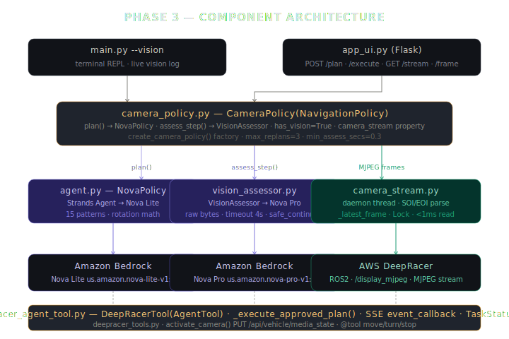
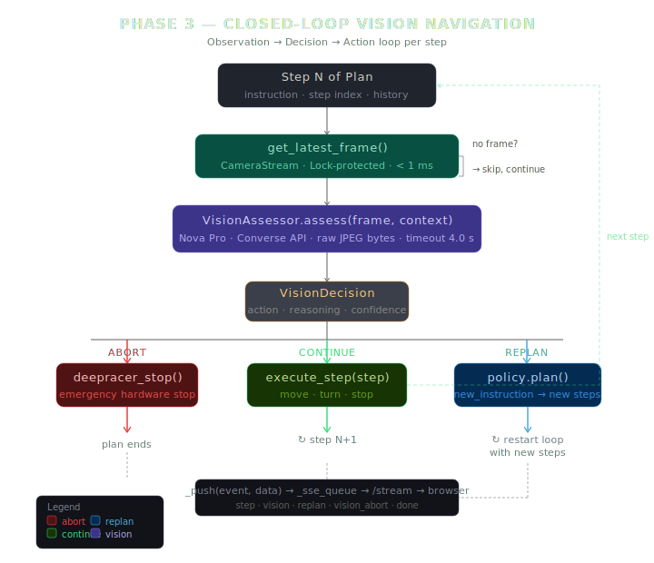

<div align="center">

 &nbsp; **×** &nbsp; 

# Phase 3 — Closed-Loop Vision Navigation

*Agentic AWS DeepRacer that sees, thinks, and adapts mid-execution — powered by Strands Agents SDK and Amazon Nova.*

[](https://strandsagents.com)
[](https://aws.amazon.com/deepracer/)
[](https://aws.amazon.com/bedrock/)
[](https://aws.amazon.com/bedrock/nova/)
[](https://python.org)

</div>

---

## Diagrams

### System Architecture


### Observation-Action Loop (per step)


---

## What Phase 3 Adds

Phase 2 was a powerful planner — type a prompt, confirm a plan, watch the car execute it. But it was **open-loop**: once execution started, nothing could change it. The car was blind.

Phase 3 adds eyes.

A non-blocking MJPEG frame buffer runs continuously in the background. Between every movement step, Amazon Nova Pro receives the latest camera frame alongside the original instruction and the current plan context. It returns a single decision: **continue**, **replan**, or **abort**. The car physically adapts mid-execution based on what it sees.

| | Phase 2 | Phase 3 |
|---|---|---|
| Planning | Nova Lite (text) | Nova Lite (text) |
| Execution | Open-loop | Closed-loop with vision |
| Camera | Not used | Live MJPEG → Nova Pro |
| Obstacle response | None | Abort / replan / continue |
| Mid-run adaptation | Not possible | Up to 3 replans per run |
| Web UI | SSE step streaming | SSE + live camera feed + vision log |

---

## Architecture

```
┌──────────────────────────────────────────────────────────────────────────────┐
│  main.py  (--vision flag)              app_ui.py  (Flask, always Phase 3)    │
│  terminal REPL with live vision log    http://127.0.0.1:5000                 │
│                                        camera feed · vision log · SSE steps  │
└─────────────────┬──────────────────────────────────┬──────────────────────────┘
                  │  instruction                      │  POST /plan  /execute
                  ▼                                   ▼
┌──────────────────────────────────────────────────────────────────────────────┐
│  camera_policy.py — CameraPolicy(NavigationPolicy)                           │
│                                                                              │
│  plan()          → delegates to NovaPolicy (Nova Lite, text planning)        │
│  assess_step()   → delegates to VisionAssessor (Nova Pro, image)             │
│  has_vision = True  ← signals DeepRacerTool to activate vision loop         │
│  camera_stream   → CameraStream instance (background MJPEG thread)          │
└──────────┬─────────────────────────────┬──────────────────────────────────────┘
           │  plan()                     │  assess_step(frame, context)
           ▼                             ▼
┌────────────────────────┐   ┌────────────────────────────────────────────────┐
│  agent.py              │   │  vision_assessor.py — VisionAssessor           │
│  NovaPolicy            │   │                                                │
│  → Strands Agent       │   │  client.converse(                              │
│  → Nova Lite           │   │    modelId="us.amazon.nova-pro-v1:0",          │
│  → validate_plan()     │   │    messages=[{image: jpeg_bytes, text: ctx}]   │
│  → _check_rotation()   │   │  ) → VisionDecision(continue|replan|abort)    │
└────────────────────────┘   └──────────────┬─────────────────────────────────┘
                                            │  raw JPEG bytes (no base64)
                                            │
                             ┌──────────────▼─────────────────────────────────┐
                             │  camera_stream.py — CameraStream               │
                             │  daemon thread: MJPEG → SOI/EOI parse          │
                             │  → _latest_frame (Lock-protected bytes)        │
                             │  get_latest_frame() → bytes | None  (<1 ms)   │
                             └──────────────┬─────────────────────────────────┘
                                            │  HTTP MJPEG stream
                                            │  GET /route?topic=/display_mjpeg
                                            ▼
┌──────────────────────────────────────────────────────────────────────────────┐
│  deepracer_agent_tool.py — DeepRacerTool(AgentTool)                         │
│                                                                              │
│  _execute_approved_plan(plan)    ← app_ui passes pre-approved plan           │
│  _execute_task_async(instruction) ← main.py / Strands agent loop            │
│                                                                              │
│  Per-step loop:                                                              │
│    1. get_latest_frame()           ← non-blocking, <1ms                     │
│    2. assess_step(frame, context)  ← Nova Pro call, ~1-3s                   │
│       ├─ "continue" → execute_step()                                         │
│       ├─ "replan"   → policy.plan(new_instruction) → replace remaining       │
│       └─ "abort"    → deepracer_stop() → break                              │
│    3. _push(event, data) → _sse_queue → /stream → browser                  │
│                                                                              │
│  asyncio.wait_for(assess, timeout=4.0s) → safe_continue() on timeout        │
│  TaskStatus: IDLE→CONNECTING→PLANNING→RUNNING→COMPLETED/STOPPED/ERROR       │
└────────────────────────────────────┬─────────────────────────────────────────┘
                                     │  aws-deepracer-control-v2
                                     │  PUT /api/vehicle/media_state (activate)
                                     │  deepracer_connect / move / stop
                                     ▼
                              AWS DeepRacer (device)
                              ROS2 camera_node → /display_mjpeg
```

---

## File Guide

| File | Purpose |
|------|---------|
| `camera_stream.py` | Background MJPEG thread — parses raw byte stream by SOI/EOI markers, holds latest frame in a `threading.Lock` buffer |
| `vision_assessor.py` | Nova Pro wrapper — `AssessContext` → `client.converse()` → `VisionDecision`. Raw bytes, no base64. Falls back to `safe_continue()` on any error |
| `camera_policy.py` | `CameraPolicy(NavigationPolicy)` orchestrator — owns stream + assessor, exposes `plan()` + `assess_step()` + `has_vision=True` |
| `agent.py` | Planner prompt, all 15 navigation patterns, rotation validator, Phase 3 vision constants, obstacle-aware step splitting rule |
| `deepracer_agent_tool.py` | `DeepRacerTool(AgentTool)` — async execution loop with vision gate, `_execute_approved_plan()`, SSE event callback |
| `deepracer_tools.py` | Six `@tool` hardware functions + `activate_camera()` (PUT `/api/vehicle/media_state`) |
| `main.py` | Terminal REPL — `--vision` flag activates Phase 3, live vision log printed as car moves |
| `app_ui.py` | Flask web server — Phase 3 only, 7 routes, SSE streaming, camera feed at `/frame` |
| `templates/index.html` | Dashboard — 4-column layout: physics · plan+results · camera+vision log · patterns |
| `.env.example` | All environment variables with calibration warnings |
| `requirements.txt` | Python dependencies (no new additions over Phase 2) |

---

## How the Vision Loop Works

### The observation-action cycle

```
                     ┌──────────────────────────────────┐
                     │  Plan: [fwd(1.0), fwd(1.0), stop] │
                     └─────────────┬────────────────────┘
                                   │
          ┌────────────────────────▼────────────────────────┐
          │            For each step in remaining_steps      │
          └────────────────────────┬────────────────────────┘
                                   │
          ┌────────────────────────▼────────────────────────┐
          │  get_latest_frame()                              │
          │  (non-blocking, <1ms, from background thread)   │
          └────────────────────────┬────────────────────────┘
                                   │ frame bytes (or None → skip)
          ┌────────────────────────▼────────────────────────┐
          │  VisionAssessor.assess(frame, AssessContext)     │
          │  asyncio.wait_for(..., timeout=4.0s)            │
          │  Nova Pro multimodal Converse API call           │
          └───────────┬────────────────┬──────────┬─────────┘
                      │                │          │
                 continue           replan      abort
                      │                │          │
              execute_step()    policy.plan()  deepracer_stop()
                      │         new steps         │
                      │              │          break
                   next step    continue loop
```

### Vision check cadence

Vision fires **between steps only** — never during a step. A `time.sleep()` inside `_move_for_duration()` cannot be interrupted.

```
  motor:   ├─ forward 1.0s ─┤  ├─ forward 1.0s ─┤  ├─ forward 1.0s ─┤
  vision:                   V                   V                   V
                          check              check              check
                         (~1-3s)            (~1-3s)            (~1-3s)
```

### Obstacle-aware step splitting

When the instruction mentions reacting to something visible (`stop when`, `halt if`, `avoid`, colour names, `obstacle`), the planner automatically breaks long forward steps into ≤ 1.0 s chunks so vision fires more frequently:

```
"move forward 3 seconds, stop on red"

WRONG:  [forward(3.0), stop]          ← vision checks only at t=3s
RIGHT:  [forward(1.0), forward(1.0), forward(1.0), stop]
                                       ← vision checks at t=1s, 2s, 3s
                                          max overshoot ≈ 0.4m
```

### Instruction-driven decision mapping

Nova Pro reads the original instruction on every call and maps the action accordingly:

| Instruction contains | Nova Pro action on obstacle |
|---|---|
| `stop when` / `stop if` / `halt` | `abort` → `deepracer_stop()` |
| `avoid` / `go around` / `navigate around` | `replan` → new instruction |
| No obstacle reference | `continue` unless collision imminent |

---

## Nova Pro API — Exact Implementation

Phase 3 uses the boto3 **Converse API** with image input. Raw JPEG bytes are passed directly — no base64 encoding required.

```python
response = client.converse(
    modelId="us.amazon.nova-pro-v1:0",
    system=[{"text": SYSTEM_PROMPT}],
    messages=[
        {
            "role": "user",
            "content": [
                {
                    "image": {
                        "format": "jpeg",
                        "source": {
                            "bytes": frame_bytes   # raw bytes — NOT base64
                        }
                    }
                },
                {"text": user_prompt}
            ]
        }
    ],
    inferenceConfig={"maxTokens": 256, "temperature": 0.1}
)

text = response["output"]["message"]["content"][0]["text"]
```

Nova Pro responds with JSON only:

```json
{
  "action": "continue",
  "reasoning": "Path is clear, no obstacles visible.",
  "new_instruction": "",
  "confidence": 0.92
}
```

### Why raw bytes, not base64

The boto3 SDK serialises `source.bytes` internally. Base64 encoding is only required when using the lower-level `invoke_model` API directly. Using `converse` with raw bytes is both simpler and avoids encoding overhead on every frame.

---

## Camera Stream — MJPEG Frame Extraction

The DeepRacer streams video as a multipart HTTP response. `camera_stream.py` extracts frames by scanning for JPEG byte markers rather than parsing multipart boundaries — this is robust regardless of boundary string format.

```
MJPEG HTTP response (chunked):
  ...--frame\r\nContent-Type: image/jpeg\r\n\r\n[JPEG bytes]--frame...

Frame extraction (SOI/EOI marker scan):
  SOI = 0xFF 0xD8   (JPEG start)
  EOI = 0xFF 0xD9   (JPEG end)

  while buffer:
      find SOI → find EOI → frame = buffer[SOI:EOI+2]
      store in _latest_frame (thread-safe Lock)
      advance buffer past EOI
```

### Critical: camera ROS node activation

The DeepRacer `camera_node` boots **dormant**. `lsusb` shows the camera present but `/display_mjpeg` has no publisher until activated. Without activation, `get_raw_video_stream()` returns an empty stream.

`activate_camera()` in `deepracer_tools.py` sends the activation:

```python
PUT /api/vehicle/media_state
{"activateVideo": 1}
```

This is the HTTP equivalent of:

```bash
ros2 service call /camera_pkg/media_state \
  deepracer_interfaces_pkg/srv/VideoStateSrv "{activate_video: 1}"
```

**Startup order in `app_ui.py`:**

```python
_get_client()       # 1. authenticate (establishes session)
activate_camera()   # 2. wake ROS camera_node
create_camera_policy()  # 3. starts CameraStream thread (which also activates)
DeepRacerTool(...)  # 4. wires event_callback to SSE queue
```

---

## Strands Robots Architecture Mapping

Phase 3 extends Phase 2's strands-robots mapping with the observation loop:

| strands-robots (GR00T) | Phase 3 |
|---|---|
| `Robot(AgentTool)` | `DeepRacerTool(AgentTool)` |
| `Policy` abstract class | `NavigationPolicy` → `CameraPolicy` |
| `get_observation()` → `{cameras, joints}` | `camera_stream.get_latest_frame()` → JPEG bytes |
| `policy.get_actions(obs, instruction)` | `vision_assessor.assess(frame, context)` → `VisionDecision` |
| Execute action chunk | `execute_step(step)` |
| Loop at 50 Hz | Loop at step boundaries (~1–5 s cadence) |
| Fixed VLA policy | Reasoning model — returns meta-decision (continue/replan/abort) |
| `TaskStatus` enum | Identical: `IDLE→CONNECTING→PLANNING→RUNNING→COMPLETED/STOPPED/ERROR` |
| `ThreadPoolExecutor(max_workers=1)` | Identical |
| `threading.Event` shutdown | Identical |
| `cleanup()` / `__del__` | Identical + `camera_stream.stop()` |

**Key difference from GR00T:** GR00T runs a fixed VLA model that always produces motor commands. Phase 3 uses a reasoning model (`nova-pro`) that produces a *meta-decision* about what to do with the existing plan. The motor commands themselves come from the Phase 2 pattern library — no trained robotics model is needed.

---

## Navigation Patterns

All 15 patterns from Phase 2 are available. When the instruction mentions obstacle detection, the planner automatically applies obstacle-aware step splitting (≤ 1.0 s chunks).

| Pattern | Steps | Rotation proof |
|---------|-------|----------------|
| `circle` (tight) | 5 | 4 × 1.5 s = 6.0 s → 360° |
| `circle` (large) | 9–17 | 4–8 arcs × calibrated duration = 360° |
| `figure-8` | 19 | 8 × 1.5 s = 12.0 s → 720° |
| `square` | 9 | 4 × 1.5 s = 6.0 s → 360° |
| `triangle` | 7 | 3 × 2.0 s = 6.0 s → 360° |
| `pentagon` | 11 | 5 × 1.2 s = 6.0 s → 360° |
| `hexagon` | 13 | 6 × 1.0 s = 6.0 s → 360° |
| `oval` | 5 | 2 × 3.0 s = 6.0 s → 360° |
| `slalom (N)` | 1+6N+1 | Left 90° + right 90° per gate |
| `lane-change` | 6 | 60° + 60° → net 0° |
| `spiral-out` | 17 | 2 rings × 4 × 1.5 s = 720° total |
| `u-turn` | 5 | 2 × 1.5 s = 3.0 s → 180° |
| `chicane` | 6 | Single S-bend |
| `parallel-park` | 9 | 3-phase parking |
| `figure-forward` | 7 | Sprint + 360° loop + return |

**Rotation calibration:**

```
heading_change (°) = (turn_seconds / 1.5) × 90
turn_seconds       = (heading_change  / 90) × 1.5

DEGREES_PER_SECOND = 60 °/s   (at STEER_ANGLE=0.50, TURN_THROTTLE=0.20)
FULL_ROTATION_SECS = 6.0 s    (360°)
```

---

## Vehicle Physics

| Property | Value | Notes |
|----------|-------|-------|
| Min turn radius | 0.28 m | Full steering lock (`STEER_ANGLE=1.0`) |
| Default arc radius | 0.35 m | Half lock (`STEER_ANGLE=0.50`) — used in all patterns |
| Max safe corner speed | 1.5 m/s | Above this → skid / spin risk |
| Forward speed | ~0.40 m/s | At `FWD_THROTTLE=0.30` |
| Turn speed | ~0.25 m/s | At `TURN_THROTTLE=0.20` — safely below 1.5 m/s |

> **Calibration warning** — `STEER_ANGLE` and `TURN_THROTTLE` are the two variables that, if changed, invalidate the `1.5 s ≈ 90°` constant. All 15 patterns depend on it. Re-measure empirically before changing either value.

---


### SSE event types

| Event | Payload | Trigger |
|-------|---------|---------|
| `start` | `{total, pattern, vision: true}` | Plan begins executing |
| `step` | `{index, action, seconds, ok, message, emergency}` | Each step completes |
| `vision` | `{step, action, reasoning, confidence}` | Each Nova Pro assessment |
| `replan` | `{count, instruction, new_steps, pattern}` | Vision triggers a replan |
| `vision_abort` | `{reasoning}` | Vision triggers emergency stop |
| `done` | `{ok_count, fail_count, abort_reason, replan_count}` | Plan finishes |
| `stopped` | `{message}` | User stops or hardware error |

### Camera feed

`/frame` serves the latest JPEG at any time. The browser polls it every 500 ms (`setInterval(refreshFrame, 500)`). Returns `204 No Content` if the stream has no frames yet.

```
Browser                    Flask /frame              CameraStream thread
   │                           │                            │
   ├── GET /frame?t=timestamp ─▶│                            │
   │                           ├─ get_latest_frame() ──────▶│
   │                           │◀─ bytes (< 1ms) ───────────┤
   │◀── 200 image/jpeg ────────┤                            │
   │    (no-store cache)       │                            │
```

---

## Routes Reference

| Method | Route | Description |
|--------|-------|-------------|
| `GET` | `/` | Dashboard (index.html) |
| `POST` | `/plan` | Call Nova Lite → validated plan JSON. Stores `_instruction_hint` |
| `POST` | `/execute` | Start `_execute_approved_plan()` in daemon thread |
| `POST` | `/stop` | Set stop flag, call `_action_stop()`, send hardware stop |
| `GET` | `/stream` | SSE endpoint — `queue.get(timeout=15)` + heartbeat every 15 s |
| `GET` | `/frame` | Latest JPEG from camera, `Cache-Control: no-store` |
| `GET` | `/vision_status` | `{enabled, running, frames, staleness}` |

---

## Setup

```bash
cd phase-3-closed-loop-vision-navigation
cp .env.example .env
```

Minimum required in `.env`:

```env
DEEPRACER_IP=192.168.0.3
DEEPRACER_PASSWORD=your_password_here
AWS_REGION=us-east-1
```

Full configuration:

```env
# ── Models ───────────────────────────────────────────────────────────────────
MODEL=us.amazon.nova-lite-v1:0          # planner (text)
VISION_MODEL=us.amazon.nova-pro-v1:0   # vision assessor (multimodal)

# ── Vision parameters ────────────────────────────────────────────────────────
VISION_TIMEOUT=4.0       # seconds before assess() falls back to "continue"
MAX_REPLANS=3            # max vision-triggered replans per execution run
VISION_MIN_STEP=0.3      # steps shorter than this skip vision assessment

# ── Motion parameters ────────────────────────────────────────────────────────
DEEPRACER_FWD_THROTTLE=0.30    # ~0.40 m/s forward speed
DEEPRACER_TURN_THROTTLE=0.20   # ~0.25 m/s turn speed
DEEPRACER_MAX_SPEED=1.0
DEEPRACER_STEER_ANGLE=0.50     # half lock → 1.5s ≈ 90° calibration
DEEPRACER_MAX_STEP_SECS=5.0
```

Install dependencies:

```bash
pip install -r requirements.txt
```

---

## Run

### Web UI

```bash
python app_ui.py
# open http://127.0.0.1:5000
```

### Terminal REPL (Phase 3)

```bash
python main.py --vision
```

### Terminal REPL (offline mock — no hardware, no Bedrock)

```bash
python main.py --mock
```

---

## Example Prompts

### Basic navigation

```
drive a full circle
do a figure-8
slalom through 3 cones
drive a square with 2-second sides
spiral outward
drive an oval loop
```

### Vision-reactive navigation

These trigger obstacle-aware step splitting (≤ 1.0 s chunks):

```
move forward and stop when you see an obstacle
drive forward 3 seconds, stop if you see red
move toward the cone and halt when it is in front of you
drive forward slowly and stop when you see tape on the floor
move forward, avoid any obstacles you see
navigate around the red marker and continue
```

### Combining patterns and vision

```
do a figure-8, stop if you see anything in the way
slalom through cones, go around any unexpected obstacles
drive a circle, abort immediately if you see a person
```

---

## Vision Decision Examples

From a live demo run:

```
step 1  ↺ REPLAN   85%  "Tape on floor indicates potential obstacle ahead."
        → Replan #1: "turn left to avoid tape" → 2 steps

step 1  ✓ CONTINUE 91%  "Path clear after turn, proceeding."

step 2  ⚠ ABORT    94%  "Red object directly in path, stopping immediately."
        → deepracer_stop() called
        → ✅ Complete — 2 steps ok, 1 replan, 1 abort
```

---

## Safety

- `VISION_ASSESS_TIMEOUT = 4.0 s` — if Nova Pro takes longer than 4 s, the step proceeds as `continue`. The car never stalls waiting for a cloud API.
- `MAX_REPLANS = 3` — prevents infinite replan loops if the model keeps seeing the same obstacle.
- `VISION_MIN_STEP = 0.3 s` — skips vision for stabilisation steps (0.3 s) that are too short to be meaningful.
- `DEEPRACER_MAX_STEP_SECS = 5.0 s` — hard cap on any step duration even if the LLM produces a longer one.
- `stop_on_failure = True` — any hardware error sends an emergency stop before the next step runs.
- Every plan is validated for `stop` as the final step before execution begins.

---

## Troubleshooting

### Camera shows 204 / no feed

The camera ROS node is dormant. `activate_camera()` is called automatically on startup and in `deepracer_connect()`, but if it fails:

1. Check `DEEPRACER_IP` and `DEEPRACER_PASSWORD` in `.env`
2. SSH into the car and run manually:

```bash
source /opt/ros/foxy/setup.bash
source /opt/aws/deepracer/lib/setup.bash

ros2 service call /camera_pkg/media_state \
  deepracer_interfaces_pkg/srv/VideoStateSrv "{activate_video: 1}"
```

3. If the service call fails, restart the DeepRacer software:

```bash
systemctl restart deepracer-core
```

### Vision always returns "continue" even on obstacles

- Check that your instruction explicitly mentions the reaction: `stop when`, `avoid`, `halt if`.
- Check `VISION_TIMEOUT` — if Nova Pro is consistently timing out, it always falls back to `continue`.
- Check that `VISION_MIN_STEP` is low enough that your steps aren't being skipped. Default is 0.3 s.

### Car overshoots obstacle before stopping

Use shorter step chunks in your instruction:

```
move forward slowly in 1 second steps, stop on obstacle
```

Or lower `VISION_MIN_STEP` to `0.3` and use 0.5 s step chunks.

### Replans loop repeatedly on same obstacle

The car replans but the new plan still faces the same obstacle. Solutions:

1. Increase `MAX_REPLANS` or lower it to `1` to force a clean abort instead.
2. Phrase your instruction to abort, not replan: `stop when you see X` instead of `avoid X`.

---

## Author

**Vivek Raja P S**

[](https://github.com/Vivek072)
[](https://linkedin.com/in/meetvivekraja)